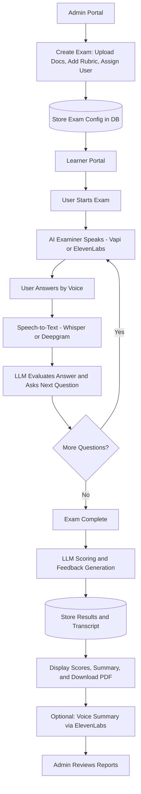

# **ExamBot — Voice-First AI Oral Exam Prototype**

A working proof-of-concept demonstrating a fully voice-driven AI oral exam experience — from user test selection to real-time AI questioning, scoring, and feedback delivery.

---

## 🧭 **Structure**

### **1. Admin Portal**

**Goal:** Show that exams can be created and assigned.

**Core Features**

- Upload reference material (PDF/DOCX/PPT) — simulates the “exam content” from the brief.
- Text fields for:
    - Exam Title
    - Learning Objectives
    - Rubric / Answer Key
- Button: **“Assign to User”** (mocked assignment; no full auth).
- Dashboard table:
    - *Exam Name | Assigned User | Status (Pending / Completed) ( Optional)*

**Stretch Goal (optional):**

View results once submitted — shows auto-generated scoring and downloadable PDF report.

---

### **2. Learner Portal**

**Goal:** Highlight the real-time **AI voice exam** experience.

**On Entry**

- Welcome message: “Hi [UserName] 👋”
- Display cards for available tests (*Test 1, Test 2, etc.*)

**On Selecting a Test**

- Initiates **voice-based interaction** using **Vapi** or **ElevenLabs** for TTS/voice synthesis.
- **Exam Flow:**
    1. AI Examiner speaks the first question aloud.
    2. Learner answers by voice.
    3. Real-time **speech-to-text transcription** appears on screen.
    4. LLM evaluates response and generates a follow-up question or proceeds to the next one.
    5. After all questions, AI thanks the learner and signals scoring completion.

**Optional Enhancements**

- “You said…” transcript validation display.
- Simple waveform animation or mic visualizer during interaction.

---

### **3. AI Scoring & Feedback**

**Goal:** Deliver dynamic, rubric-based evaluation and voice summary.

**After Exam Completion**

- LLM (GPT-4 or GPT-4o-mini) uses the transcript and rubric to:
    - Score each question and criterion.
    - Generate a written **summary and feedback paragraph.**
- Feedback is displayed instantly and optionally exported as a **PDF**.

**Optional Enhancements**

- Radar chart visualization (Criteria vs. Score).
- **Voice Summary via ElevenLabs TTS** — “Here’s how you did today…”

---

## 🔥 **Prototype Flow Summary**

1. **Admin uploads** document + rubric → creates an exam.
2. **User enters** → sees available exams.
3. **User starts voice exam** → AI speaks questions, listens, and responds dynamically.
4. **Transcript + answers** are scored via LLM.
5. **Feedback summary** and optional **voice report** are generated.
6. *(Optional)* Admin views completed exam results and PDF report.

---

## ⚙️ **Tech Highlights**

| Layer | Tool | Role |
| --- | --- | --- |
| **Voice Input/Output** | **Vapi** / **ElevenLabs** | Natural conversation loop |
| **Speech-to-Text** | Whisper / Deepgram | Real-time transcription |
| **LLM** | GPT-4o-mini | Questioning logic + scoring |
| **Frontend** | React + Tailwind | Simple, clean UI |
| **Storage** | Supabase | Store transcripts + scores |
| **PDF Export** | jsPDF / react-pdf | Feedback report generation |
| **Hosting** | Vercel | Fast prototype deployment |

---

## 🎯 **Expected Outcomes**

1. **Voice Interaction Excellence**
    - The AI Examiner (via **Vapi** or **ElevenLabs**) delivers a smooth, natural conversation.
    - Voice feels human and responsive, addressing **Sam Orton** by name for personalization.
2. **Live Transcription & Evaluation**
    - User answers are transcribed in real time using **Whisper** or **Deepgram**.
    - The **LLM** interprets responses and manages the exam flow dynamically.
3. **Automated Scoring & Summary PDF**
    - After the session, the **LLM** scores each answer based on the rubric.
    - A clean **Summary PDF** is generated with scores, feedback, and optional voice recap.